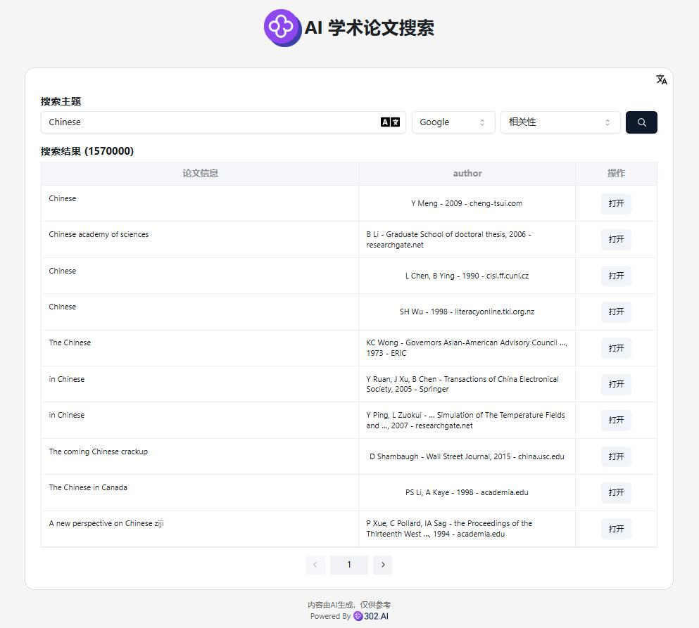
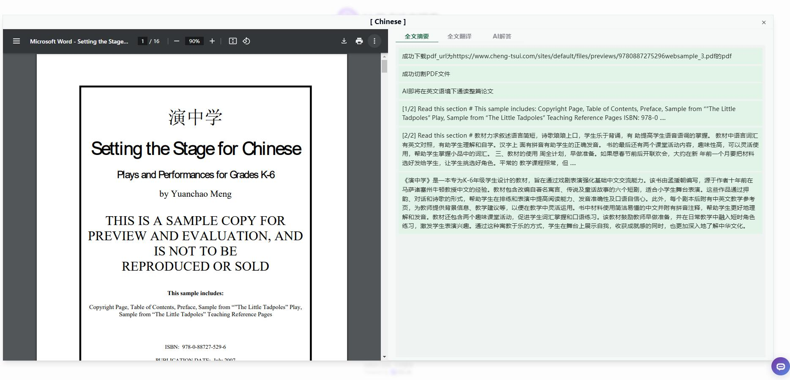
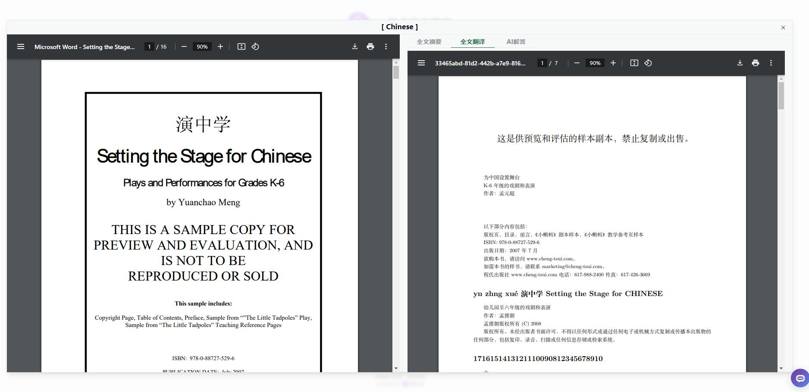
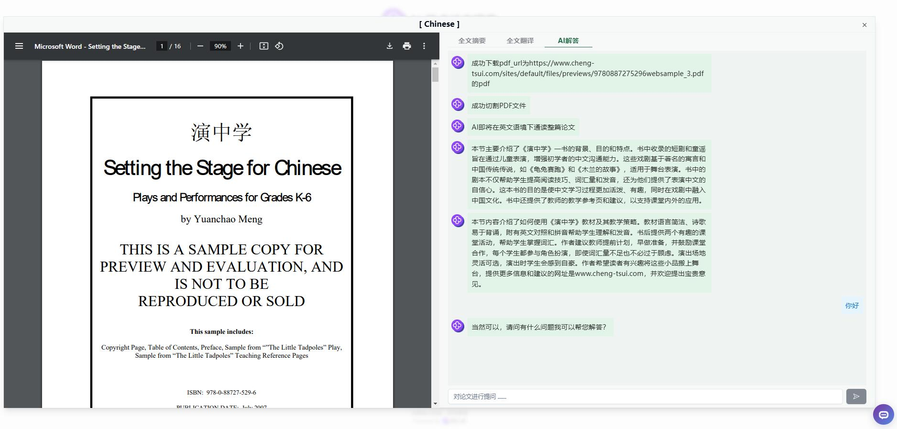

# 💻🤖 Welcome to 302.AI's AI Academic Paper Search! 🚀✨

[中文](README_zh.md) | [English](README.md) | [日本語](README_ja.md)

This is the open-source version of the [AI Academic Paper Search](https://302.ai/tools/academic/) by [302.AI](https://302.ai). You can log in directly to 302.AI and use the online version with zero code and zero configuration, or modify this project according to your own needs, input your API KEY from 302.AI, and deploy it yourself.

## ✨ About 302.AI ✨

[302.AI](https://302.ai) is a pay-as-you-go AI application platform designed to solve the last mile problem of AI implementation for users.
1. 🧠 It aggregates the latest and most comprehensive AI capabilities and brands, including but not limited to language models, image models, audio models, and video models.
2. 🚀 Conducts deep application development on foundational models, creating real AI products rather than simple chatbots.
3. 💰 Zero monthly fees, all features are available on a pay-as-you-go basis, fully open with truly low barriers and high limits.
4. 🛠 A powerful management backend aimed at teams and SMEs, allowing one-person management and multi-user access.
5. 🔗 All AI capabilities provide API access, and all tools are open source for customization (in progress).
6. 💡 A strong development team releases 2-3 new applications each week, with daily product updates. Developers interested in joining us are welcome to contact us.

### Project Features

1. **🔤 PDF Translation**:
   - Real-time translation of PDF content, supporting multiple languages.
   - Allows users to select the target language for multilingual access to document content.

2. **🤖 AI Full Text Parsing**:
   - Utilizes AI technology to automatically parse the full text of papers, extracting key content and information.
   - Provides summaries and analyses of the paper content, helping users quickly understand the core of the paper.

3. **🧠 AI Q&A System**:
   - Offers intelligent Q&A functionality, allowing users to ask questions about specific paper texts.
   - AI generates answers in real-time based on the paper content, improving the efficiency of information retrieval.

4. 🌐 Comprehensive Internationalization: Supports interface switching between Chinese, English, and Japanese.

With AI Academic Paper Search, we can easily and quickly access paper information. 🎉💻 Let's explore the AI-driven world of coding together! 🌟🚀

## Tech Stack
- React
- Tailwind CSS
- Shadcn UI

## Development & Deployment
1. Clone the project `git clone https://github.com/302ai/302_academic_thesis_search`
2. Install dependencies `npm install`
3. Configure the 302 API KEY according to .env.example
4. Run the project `npm dev`
5. Build and deploy `docker build -t academic-thesis-search . && docker run -p 3000:80 academic-thesis-search`

## Interface Preview

