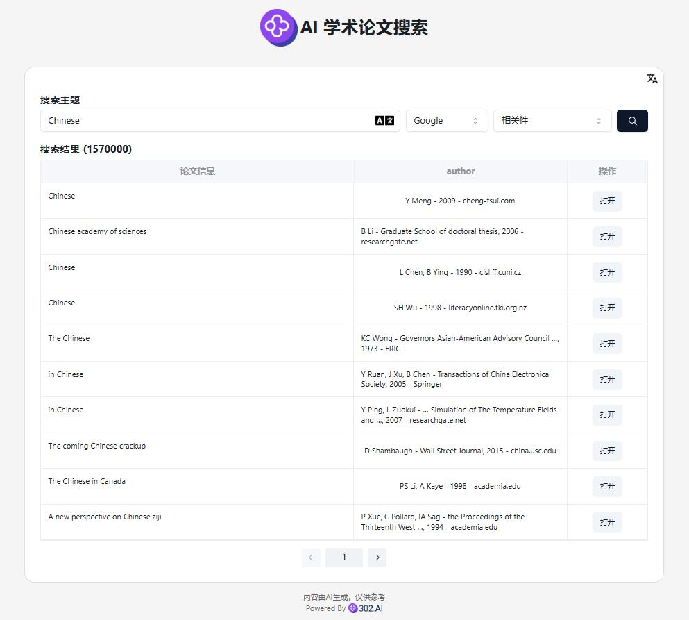
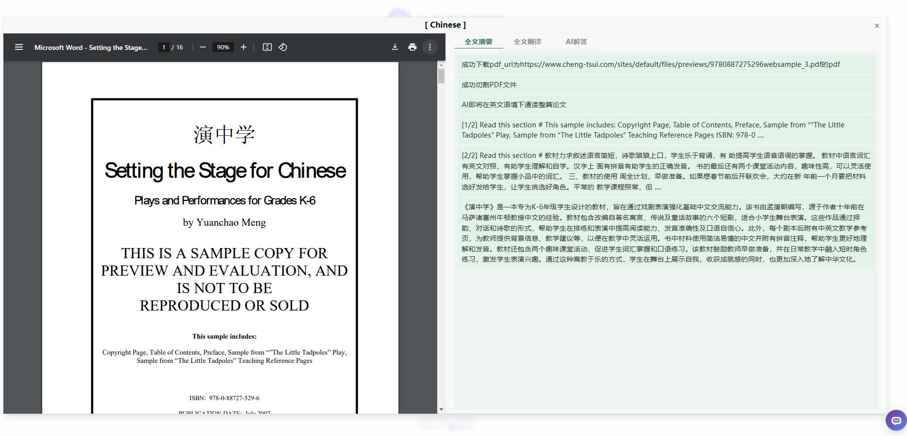
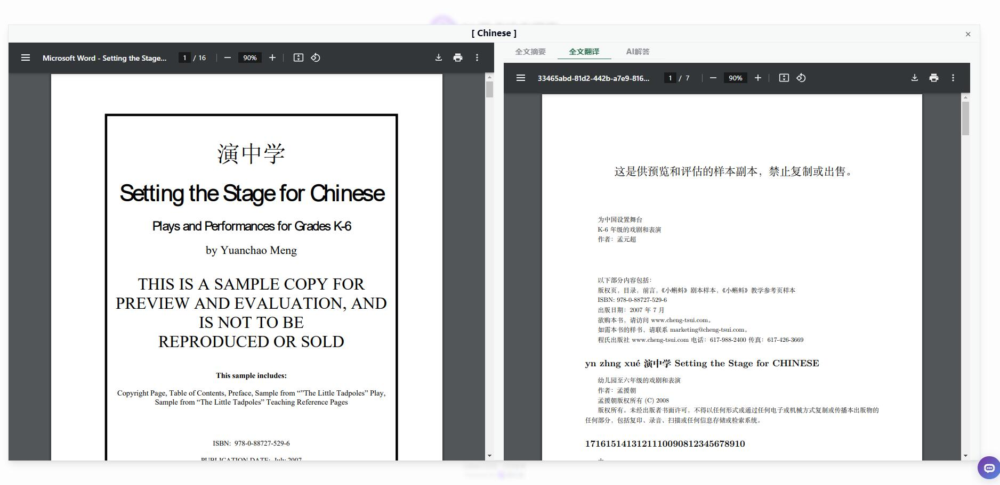
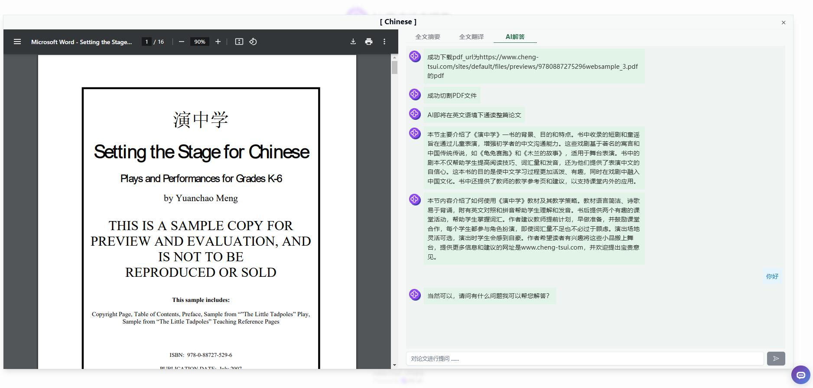

# 💻🤖 302.AIのAI学術論文検索へようこそ! 🚀✨

[中文](README_zh.md) | [English](README.md) | [日本語](README_ja.md)

これは、[302.AI](https://302.ai)による[AI学術論文検索](https://302.ai/tools/academic/)のオープンソースバージョンです。302.AIに直接ログインしてコード不要でオンラインバージョンを利用することができます。また、このプロジェクトを自身のニーズに合わせて変更し、302.AIのAPIキーを入力して自分でデプロイすることも可能です。

## ✨ 302.AIの紹介 ✨

[302.AI](https://302.ai)は、ユーザーがAIを実践で活用するためのラストマイル問題を解決する、オンデマンドのAIアプリケーションプラットフォームです。
1. 🧠 最新かつ最も包括的なAI機能とブランドを集めており、言語モデル、画像モデル、音声モデル、ビデオモデルなどが含まれます。
2. 🚀 基本モデルに基づいて深いアプリケーション開発を行い、単なるチャットボットではない本物のAI製品を開発します。
3. 💰 月額料金ゼロ、すべての機能は必要に応じて利用料を支払い、全面的に開放されており、低い参入障壁と高い上限を実現しています。
4. 🛠 チームや中小企業向けの強力な管理バックエンドを備え、一人での管理と多人数での利用が可能です。
5. 🔗 すべてのAI機能はAPI接続を提供し、すべてのツールはオープンソースでカスタマイズが可能です（進行中）。
6. 💡 強力な開発チームが毎週2～3本の新しいアプリケーションをリリースし、毎日製品を更新します。興味のある開発者はぜひご連絡ください。

### プロジェクト特徴

1. **🔤 PDF翻訳機能**：
   - PDFコンテンツをリアルタイムで翻訳し、多言語に対応しています。
   - ユーザーが対象言語を選択して、文書内容の多言語アクセスを実現します。

2. **🤖 AI全文解析**：
   - AI技術を利用して論文全文を自動的に解析し、重要な内容と情報を抽出します。
   - 論文内容の要約と分析情報を提供し、ユーザーが論文の核心を迅速に理解できるようにします。

3. **🧠 AI質問応答システム**：
   - インテリジェントな質問応答機能を提供し、特定の論文テキストに関する質問ができます。
   - AIが論文内容に基づいてリアルタイムで回答を生成し、情報取得の効率を向上させます。

4. 🌐 完全な国際化：日本語、英語、中国語のインターフェース切り替えをサポートします。

AI学術論文検索を通じて、迅速かつ簡単に論文情報をアクセスできます。🎉💻 AIが駆動するコーディングの新しい世界を共に探索しましょう！🌟🚀

## 技術スタック

- React
- Tailwind CSS
- Shadcn UI

## 開発＆デプロイ
1. プロジェクトをクローン `git clone https://github.com/302ai/302_academic_thesis_search`
2. 依存関係をインストール `npm install`
3. 302のAPIキーを設定する .env.example を参照してください
4. プロジェクトを実行 `npm dev`
5. ビルドとデプロイ `docker build -t academic-thesis-search . && docker run -p 3000:80 academic-thesis-search`

## インターフェースプレビュー

